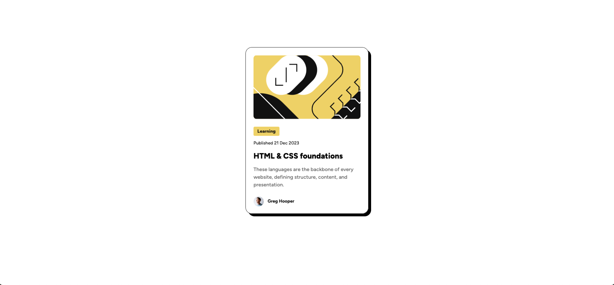

# Frontend Mentor - Blog preview card solution

This is a solution to the [Blog preview card challenge on Frontend Mentor](https://www.frontendmentor.io/challenges/blog-preview-card-ckPaj01IcS). Frontend Mentor challenges help you improve your coding skills by building realistic projects. 

## Table of contents

- [Frontend Mentor - Blog preview card solution](#frontend-mentor---blog-preview-card-solution)
  - [Table of contents](#table-of-contents)
  - [Overview](#overview)
    - [Screenshot](#screenshot)
    - [Links](#links)
  - [My process](#my-process)
    - [Built with](#built-with)
    - [What I learned](#what-i-learned)
    - [Continued development](#continued-development)
  - [Author](#author)

**Note: Delete this note and update the table of contents based on what sections you keep.**

## Overview

### Screenshot

### Links

- Solution URL: [Link](https://github.com/samehelhawary/blog-preview-card)
- Live Site URL: [Link](https://dreamy-sfogliatella-98149c.netlify.app/)

## My process

### Built with

- Semantic HTML5 markup
- Flexbox
- Mobile-first workflow
- [vite](https://vite.dev/) - Build Tool

### What I learned

How to configure vite (vanilla JS) with tailwindcss.

### Continued development

I want to focus in improving my skills using tailwindcss.

## Author

- Frontend Mentor - [@samehelhawary](https://www.frontendmentor.io/profile/samehelhawary)

